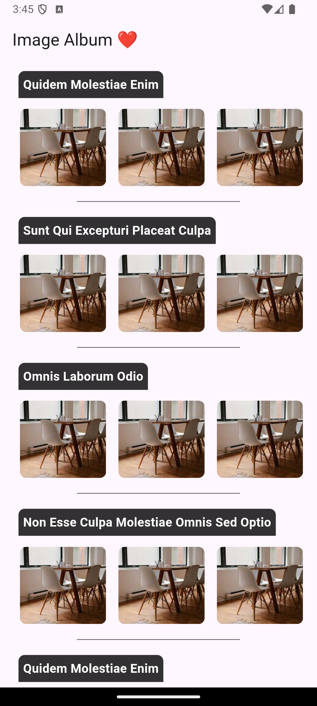

# 📸 Image Album App

A Flutter app that fetches albums and their images using BLoC pattern, with local caching, pagination, and a clean architecture approach. Built as part of an assignment to demonstrate scalable, testable app architecture.

---

## 🏗️ Architecture Overview

The project follows **Clean Architecture**, split into 3 major layers:

1. **Presentation Layer**
    - Uses `flutter_bloc` for state management.
    - Stateless + Stateful widgets that render UI.
    - Events trigger BLoC which emits states to reflect UI changes.

2. **Domain Layer**
    - Contains `Entities` (pure Dart models) and `UseCases`.
    - Abstracts business logic and remains UI/data-agnostic.

3. **Data Layer**
    - Handles data sources:
        - **Remote**: via `Dio` HTTP client calling [typicode JSONPlaceholder API](https://jsonplaceholder.typicode.com/).
        - **Local**: via `Hive` database for persistent caching.
    - Repository coordinates between sources based on availability.

---

## ⚙️ Tech Stack

- **Flutter** (Dart 3)
- **flutter_bloc** for reactive state management
- **Hive** for local storage
- **GetIt** for dependency injection
- **Dio** for networking
- **CachedNetworkImage** for optimized image loading

---

## 📁 Folder Structure

```text
lib/
├── core/
│   └── service/                  # Shared service interfaces & implementations
├── data/
│   └── images_album/            # Data layer (Remote & Local sources)
├── domain/
│   └── image_album/             # Entities, Repository Interfaces & UseCases
├── presentation/
│   └── image_album/             # BLoC, Screens, Widgets
├── main.dart
```

---

## 💡 Features

- ✅ BLoC-based clean state management
- ✅ Scroll-based pagination for albums and album images
- ✅ Horizontal scrolling of album images (Grid layout)
- ✅ Caching albums and image pages with Hive (keyed by page & album)
- ✅ BLoC unit tests (using `bloc_test`)
- ✅ Capitalized UI text using helpers

---

## 🚀 Pagination Strategy

- Album list fetched page-wise using `FetchAlbums(fetchNextPage: true)`
- Album images fetched per album + page using `LoadImagesForAlbum(albumId, fetchNextPage: true)`
- Each page stored in Hive under a box and key combination like:
    - `album_page_1`
    - `images_album_{albumId}_page_2`

---

## 🧪 Testing

- Mocked `GetAlbumUseCase` and `GetImagesUseCase` using `mocktail`.
- Tested both initial load and pagination behavior of `ImageAlbumBloc`.


## 📷 Sample UI


---

## 👤 Author

Avijit Goswami  
📧 [avijitgoswami72@gmail.com]
💼 [https://github.com/foolishGeek]
